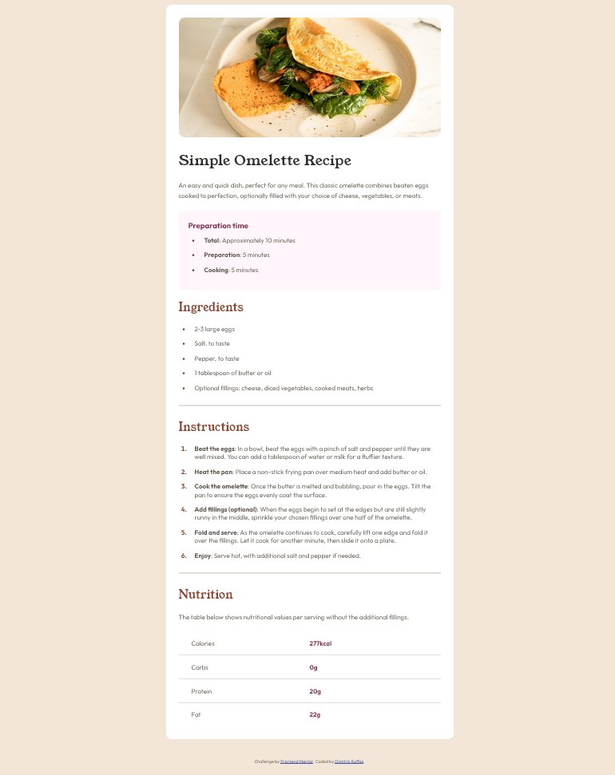

# Frontend Mentor - Recipe page solution

This is a solution from Dimitris Kaffes to the [Recipe page challenge on Frontend Mentor](https://www.frontendmentor.io/challenges/recipe-page-KiTsR8QQKm).

## Table of contents

- [Overview](#overview)
  - [The challenge](#the-challenge)
  - [Screenshot](#screenshot)
  - [Links](#links)
- [My process](#my-process)
  - [Built with](#built-with)
  - [What I learned](#what-i-learned)
  - [Continued development](#continued-development)
  - [Useful resources](#useful-resources)
- [Author](#author)

## Overview

Mobile-first design was implemented.

The main objective was to build a good HTML structure, using semantic landmark elements.

Custom properties were used for the colors, font-weight and margin-bottom.

Ordered and unordered lists with distinct marker coloring were used.

A table was used for the nutrition part. `scope="row"` in the `th` header cells of the `table` improve accessibility.

### The challenge

The challenge is to build out this recipe page and get it looking as close to the design as possible.

### Screenshot

### Links

- Solution URL: [recipe-page solution on Github](https://github.com/dkaffes/recipe-page)
- Live Site URL: [recipe-page live site](https://dkaffes.github.io/recipe-page/)

## My process

A mobile-first approach was followed.

The HTML was structured using semantic elements.

Improvements relating to accessibility where taken into account:

- For the `image` element a detailed `alt` attribute was added.
- For the `table` element header cells `th` were added and were given the `scope="row"` attribute.

The CSS styling was done trying to avoid unnecessary declarations.

Custom properties were used for the colors, font-weight and margin-bottom.

A very simple CSS reset was used.

A media query was used to slightly change the `.wrapper` and the `img` properties.

### Built with

- Semantic HTML5 markup
- CSS custom properties
- Flexbox
- Mobile-first workflow

### What I learned

- Further reinforced the process of building a solid HTML structure.
- Better organising the CSS stylesheet.
- How to manipulate lists and list markers.
- How to use the `table` element with all the related elements and attributes for improving accessibility.

### Continued development

A modern CSS reset must be used in future projects after understanding all its declarations.

Further investigating the accessibility subject.

### Useful resources

- [HTML table advanced features and accessibility](https://developer.mozilla.org/en-US/docs/Learn/HTML/Tables/Advanced) - This helped me understand HTML tables.
- [Lists](https://web.dev/learn/css/lists) - This article helped me with lists, list-types and markers.

## Author

- Frontend Mentor - [@dkaffes](https://www.frontendmentor.io/profile/dkaffes)
